# kocchiyomi
Mobile Programming Project made with Kotlin

### Group
- Felicia Kwan - 2440006305
- Jason Sebastian Sulistyawan - 2401960675
- Kelvin Julian - 2401962213
- Martinus Grady Naftali - 2401962453

### Class
LH01

# A Manga Reader App using the MangaDex API
Thanks! <a href='https://api.mangadex.org/docs/'>MangaDex</a> for the API 😉

## Postman <a href='https://app.getpostman.com/join-team?invite_code=b7f14b6a982de8934298486a70c55ce5&target_code=74ad2e0efa9109c3df227b61951511ac'>here!</a>

# Project Documentation

1.	Sign In Page

 

When the user first open the app, the sign in page will pop up. Here, the user can input the existing credentials in order to continue to another page. The user can input the email and password then click the sign in button. The credentials will be authenticated with firebase. If the user doesn’t have an account yet, we’ve also prepared a button to sign up from the sign in page.

 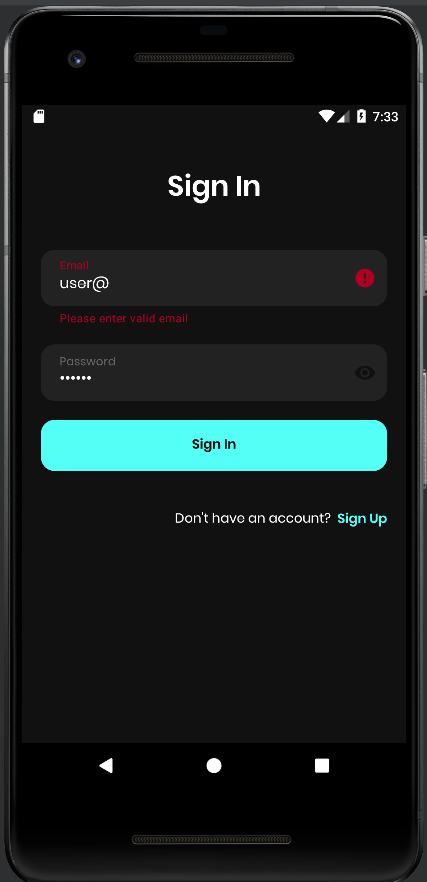
 
There is also validation steps in the login page so the user have to input the email in a proper email format and the password will also be censored into circles. But the user can click the eye button in the right side of the password box to see the words.

  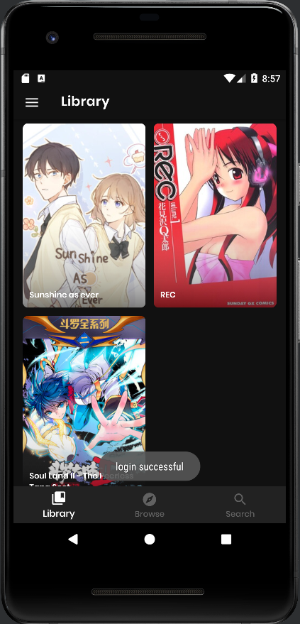
  
If the login is successful, the user will be navigated to the library page and there will be a pop up saying the login is successful

2.	Sign Up Page

  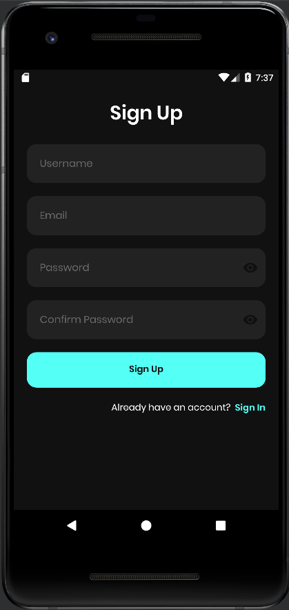
  
If the user doesn’t have an account yet, then the user can make the account in this sign up page. The user will be asked to input some data as shown in the page, which are username, email, password and confirm password. We use firebase for this. After the data is input, the user can click the sign up button to register his/her account. Other than that, if it turns out that the user already have an account, we also provide a button to go back to the sign in page. 
 
 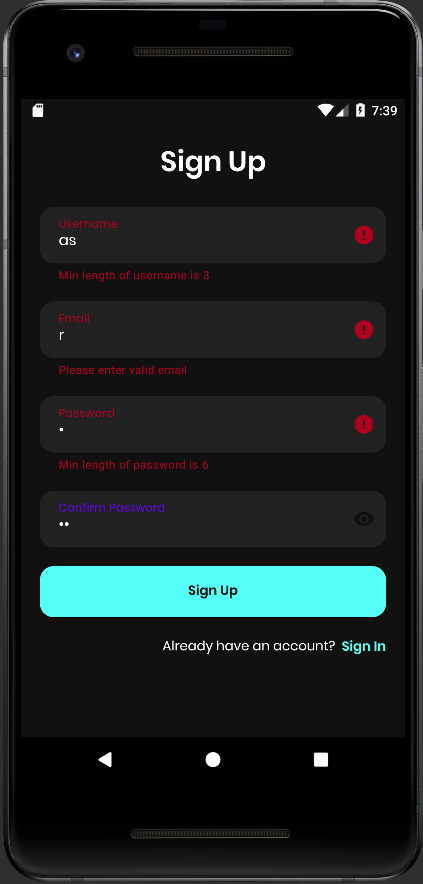
 
The Sign Up Page also has some validation steps and error message in case the data input is not suitable with the provision as we can see in the picture above. 
 
  
  
If the user still try to push the sign up button with all the error message, then the user will not be able to get in and instead, he/she will receive a pop up asking him/her to recheck the data.
 
 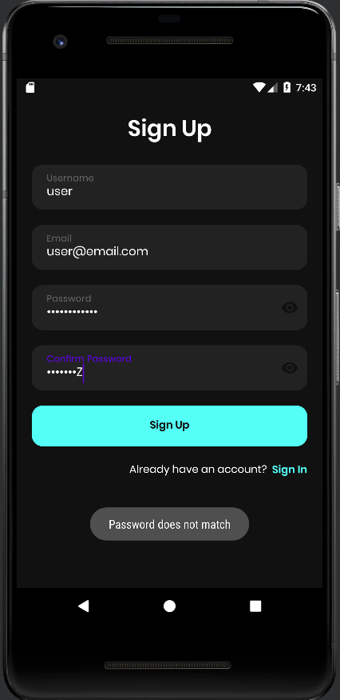
 
If the words in the “password” box and “confirm password” box is different, then there will be a pop up notifying the user that the password does not match. 

  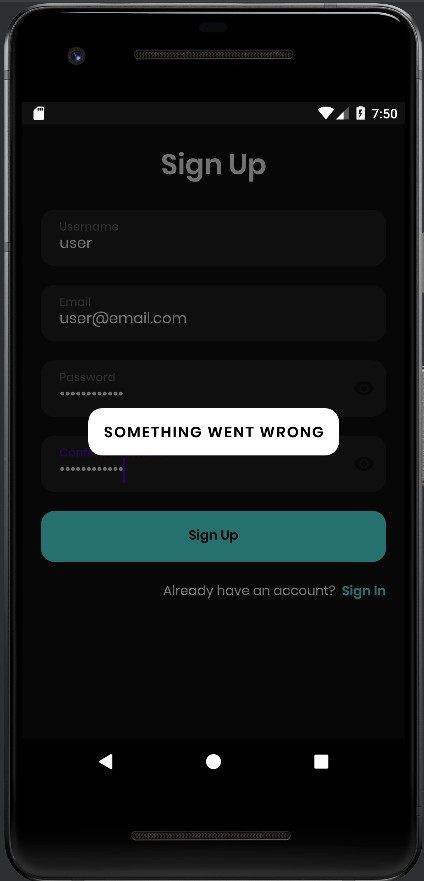
  
The pop up, as shown above, will be shown if there is an error

3.	Library Page

  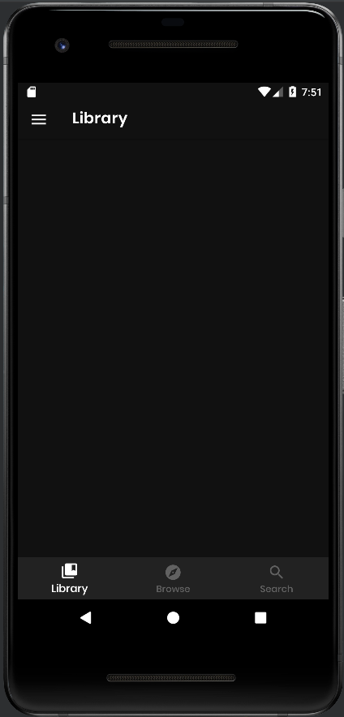
  
When the user succeed in logging in, the user will be directed to the library page. The above image show how it will look like when the library is empty. The user can add mangas they like to the library to help the user to find those mangas easier. 

  
  
The image above shows how it will look like when the user has added some manga to the library, as we can see, the manga cover will be shown and we can directly click on it to see the manga details in the Manga Info Page. In here, we use recycler view list view to show the list of mangas. So is in browse, search and chapters. With this list view, once the user saw it, it could still be seen even when the user is offline and close the app.

4.	Manga Info Page

  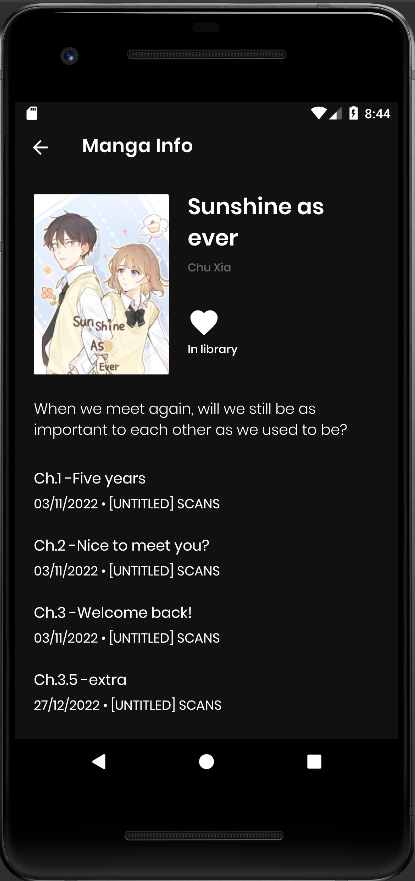
  
The Manga Info Page will show the information of a certain manga. It will also give a heart button to put the manga in the library. The heart will be full white when it is added to the library and will be empty when it is not in the library yet. And below the information, we can see chapters. When we click one of the chapter, we will be able to read that chapter of the manga

5.	Read Manga Page

  
  
On top of the page, we use tabs to show the list of pages available, so we can move to another page by clicking one of the number above. Other than that, we use pager so that the user can move to the next page by swiping to left or right. There’s also an underline below the number to show which page is the user in. 

6.	Browse Page

  
  
If we navigate to the Browse Page, we will see lists of manga covers. User can scroll down to see more mangas and if the user click on one of the mangas, then it will be navigated to the Manga Info Page of that certain manga.

7.	Search Page

  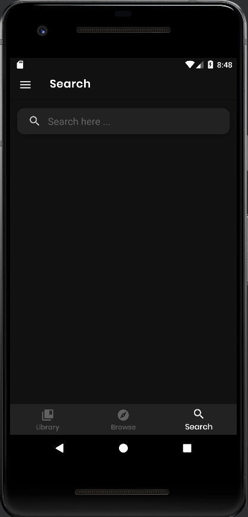
  
In the search page, the user can type in the search bar to find a certain manga the user like.

  
  
As shown in the image above, when the user type a certain keyword, mangas with corresponding keyword will pop up and the user can search from there. Then if the user want to change the keyword, the user can erase manually or simply click the x on the right side of the search bar to erase the whole keyword. 

8.	Bottom Navigation Bar

  
  
With the bottom navigation bar, the user will be able to easily move tabs. The icon will be highlighted if the user is in that certain tab.
9.	Drawer
  
  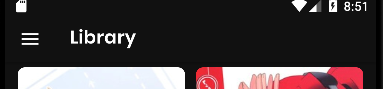
  
  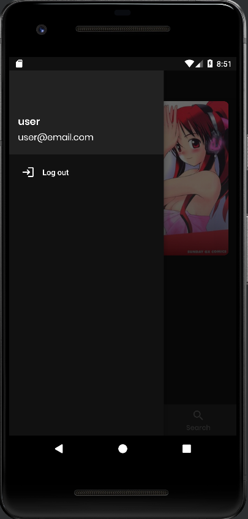
  
If we see in the top left corner of the page, we can see that there is a burger icon. When the user click the burger icon, the drawer will slide out showing the username of the user and the user’s email. Other than that, it will show the log out button to the user. When the log out button is pressed, the user will be navigated back to the sign in page.

# Documentation on Updates
-	October 28, 2022
The project was initialized

-	November 11, 2022
The Sign In and Sign Up UI was made and the README.md was updated to explain the concept of our project

-	November 12, 2022
The SignIn and SignUp Id Name was editted

-	November 13, 2022
The Firebase Registration Auth was added

-	November 14, 2022
Try adding the mainActivity

-	December 2, 2022
The Recyler View for Manga List and the HTTP API into a Java Interface was added

-	December 3, 2022
The Bottom Nav was created, and the kotlin extension was updated to using Binding. The Browse Recyler View was also added. Other than that, a Black Action Bar was added and the rest is doing refactor.

-	December 6, 2022
The Manga Info Page was added, at the same day, the Manga Info Chapter was updated to hide null chapter

-	December 7, 2022
The Swipe to Refresh Feature was added

-	December 9, 2022
The Manga Page Reader was added, and the Bottom navigation & action bar visibility bug was fixed

-	December 14, 2022
The Login and Register with view model was added and the login password and navigation bug was fixed

-	December 15, 2022
The App side drawer was made, the login and register empty field handler was fixed, the signout function was added and the back button stack was fixed.

-	December 16, 2022
The project was fixed to support android version below 12

-	December 17, 2022
The Main ViewModel, Tab on the reader page and exclude tag on browse was added, and there was a fix in duplicate call function on setDrawerHeader()

-	December 18, 2022
The library was added, then add to Library Firestore Function. Other than that, the data Persistent when re-login was fixed

-	December 19, 2022
The Offline Chapter List and Offline Browse was added, the Limit Call to Firestore and Chapter fetch from cache If online was fixed, and the history tab was changed to search

-	December 31, 2022
The manga model was fixed from serializeable to parcelable

-	January 1, 2023
The Search Page and App Icon was added, and the unused resources, dependencies, classes, attributese, interface, etc was removed. Then the Nested Scroll on Search Page was updated. The Chapter List was fixed by adding hasfixedsize and remove wrap content. Other than that, this documentation was made in readme.
