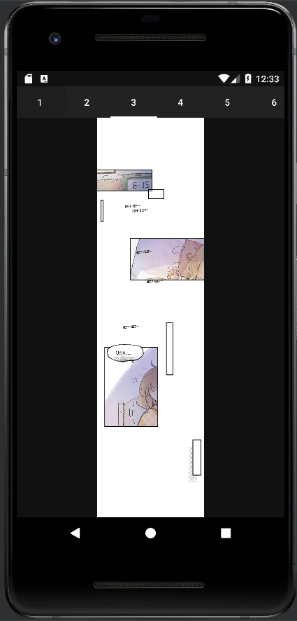

# kocchiyomi

Mobile Programming Project made with Kotlin

## Class

LH01

## Group

- Felicia Kwan - 2440006305
- Jason Sebastian Sulistyawan - 2401960675
- Kelvin Julian - 2401962213
- Martinus Grady Naftali - 2401962453

# A Manga Reader App using the MangaDex API

Thanks! [MangaDex](https://api.mangadex.org/docs/) for the API 😉

 

# Postman can be accessed [here!](https://www.postman.com/speeding-firefly-189038/workspace/f123e837-6a77-44b7-99f7-9b7104b9705b/overview)

# Project Documentation

## 1. Sign In Page

 

When the user first opens the app, the Sign In page will be displayed first. Here, the user can input their credentials (email and password) in order to Sign In and continue to another page. The user can input the email and password and then click the sign in button. The credentials will then be authenticated with FirebaseAuth. If the user doesn’t have an account yet, we’ve also prepared a button to sign up from the sign in page.

 

There is also placeholder texts in the form so the user knows to input the email in a proper email format and the password will also be censored for security reasons. The user can click the eye button in the right side of the password box to uncensor the enterred password.

  

If the Sign Up was successful, the user will be navigated to the library page and there will be a pop up saying the login is successful

## 2. Sign Up Page

  
  
If the user doesn’t have an account yet, then the user can make the a new account in this Sign Up page. The user will be asked to input some data as shown in the page, which are a username, email, password and confirm password. Again, we use FirebaseAuth and to store the username and more info we also use the Firestore Database. After the data is inputted, the user can click the sign up button to create his/her account. Other than that, if it turns out that the user already have an account, we also provide a button to go back to the sign in page.

  

The Sign Up Page also has some validation steps and error message in case the data input is not suitable with the provision as we can see in the picture above.

  
  
If the user still tries to push the sign up button with all the error messages, then the user will not be able to get in and instead, he/she will receive a pop up asking him/her to recheck the data.

  

If the words in the “password” box and “confirm password” box is different, then there will be a pop up notifying the user that the password does not match.

  
  
The pop up, as shown above, will be shown if there is an error

## 3. Library Page

  
  
When the user succeeds in logging in, the user will be directed to the library page. The above image shows how it will look like when the library is empty. The user can add mangas they like to the library to help the user to find those mangas easier.

  
  
The image above shows how it will look like when the user has added some manga to the library. The manga saved by the users are stored in the Firestore Database based on the manga id. As we can see, the manga cover will be shown and we can directly click on it to see the manga details in the Manga Info Page. In here, we use RecyclerView ListView to show the list of mangas. So as in browse, search and chapters pages. With this ListView, once the user has seen it, it could still be seen even when the user is offline and close the app, we implemented this using Offline Caching using Room, where we cache the fetched data from Firebase (Firestore).

## 4. Manga Info Page

  
  
The Manga Info Page will show the information of a certain manga. It also has a heart button to put the manga in the library. The heart will be full white when it is added to the library and will be empty when it is not in the library yet. And below the information, we can see chapters. When we click one of the chapters, we will be able to read that chapter of the manga

## 5. Read Manga Page

  
  
  
  
On top of the page, we use tabs to show the list of pages available, so we can move to another page by clicking one of the number above. Other than that, we use pager so that the user can move to the next page by swiping to left or right. There’s also an underline below the number to show which page is the user in.

## 6. Browse Page

  
  
If we navigate to the Browse Page, we will see lists of manga covers. User can scroll down to see more mangas and if the user click on one of the mangas, then it will be navigated to the Manga Info Page of that certain manga.

## 7. Search Page

  
  
In the search page, the user can type in the search bar to find a certain manga the user like.

  
  
As shown in the image above, when the user type a certain keyword, mangas with corresponding keyword will pop up and the user can search from there. Then if the user want to change the keyword, the user can erase manually or simply click the x on the right side of the search bar to erase the whole keyword.

## 8. Bottom Navigation Bar

  
  
With the bottom navigation bar, the user will be able to easily move tabs. The icon will be highlighted if the user is in that certain tab.

## 9. Drawer
  
  
  
  
  
If we see in the top left corner of the page, we can see that there is a burger icon. When the user click the burger icon, the drawer will slide out showing the username of the user and the user’s email. Other than that, it will show the log out button to the user. When the log out button is pressed, the user will be navigated back to the sign in page.

# Documentation on Updates

- October 28, 2022
Initialized project with Kotlin

- November 11, 2022
Added Sign In and Sign Up UI

- November 12, 2022
Fixed up the Sign In adn Sign Up UI to implement best practices, also added some libraries to be used later on

- November 13, 2022
Implemented Firebase Registration Auth

- November 14, 2022
Switched to Fragments and fixed the MainActivity

- December 2, 2022
Implemented RecylerView for Manga List and the HTTP Request for the Manga List

- December 3, 2022
Created Bottom Nav and implemented binding instead of Kotlin extension. The Browse Recyler View was also added. Other than that, a Black Action Bar was added and the rest is doing refactor.

- December 6, 2022
Added Manga Info Page and Fixed Manga Info Chapter to handle null chapter(s)

- December 7, 2022
Implemented Swipe to Refresh

- December 9, 2022
Added Manga Page Reader and Fixed Bottom navigation & action bar visibility bug

- December 14, 2022
Added Login and Register view model and Fixed login password and navigation bug

- December 15, 2022
Added App side drawer, Fixed login and register empty field handler, Added signout function and Fixed back button stack bug

- December 16, 2022
Updated project to support android version below 12 on UI

- December 17, 2022
The Main ViewModel, Tab on the reader page and exclude tag on browse was added, and there was a fix in duplicate call function on setDrawerHeader()

- December 18, 2022
The library page was added, then add to Library Firestore Function. Other than that, the data Persistent when re-login was fixed

- December 19, 2022
The Offline Chapter List and Offline Browse was added, the Limit Call to Firestore and Chapter fetch from cache If online was fixed, and the history tab was changed to search

- December 31, 2022
The manga model was fixed from serializeable to parcelable

- January 1, 2023
The Search Page and App Icon was added, and cleaned the unused resources. Updated the Nested Scroll on Search Page. Fixed Chapter List by adding hasfixedsize and removed wrap content.